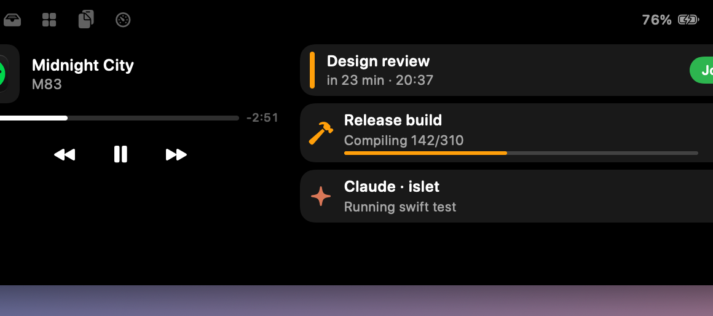

# Islet

**A free, open-source Dynamic Island for the Mac notch.** It shows what's happening across your Mac — music, calls, timers, downloads, coding agents, builds, notifications — in the space around the notch, and lets any app, script or device put a live activity there.


## Why another notch app

Most notch apps are paid, closed, or fragile (see the [research](docs/RESEARCH.md)): NotchNook went offline in 2026, Now Playing broke for everyone in macOS 15.4, and several apps burn 25–100% CPU. Islet is built around those failures:

- **Free and MIT-licensed.** No account, no license server, no telemetry. Clean-room code, so it isn't bound by the GPL.
- **Costs nothing when idle.**
  - Measured 0.0% CPU at idle and with music animating, 0.6% with a live countdown, 65–85 MB of memory.
  - Everything is event-driven; animations run in Core Animation; the pointer isn't watched until it reaches the notch.
  - `make perf` checks each state against a budget.
- **Now Playing that keeps working.** A system-wide bridge (verified on macOS 27) backed by Music/Spotify integrations and a push API, with an end-to-end test that drives a fake player through it.
- **Connects to everything.** A CLI, a local HTTP API, a URL scheme, xbar-compatible script widgets, coding-agent hooks, iPhone Shortcuts over your local network, and mirrored notifications from every app.
- **Behaves like the iPhone.**
  - Compact wings, detached bubbles for up to three things at once, sneak peeks when something new arrives.
  - Live countdowns and call timers, segmented progress.
  - A glow when something needs you, trackpad haptics, spring morphing.
- **Stays out of the way.**
  - Hover must dwell (a fast pass to the menu bar doesn't open it); it hides in fullscreen.
  - Everything outside the island is click-through.
  - Per-app rules; five motion styles including *Off*.
  - Size presets from Compact to Large; nothing asks for permission until you turn the feature on.

## Features

| | |
|---|---|
| **Now Playing** | Any app (Music, Spotify, browsers, podcasts, video players): artwork, equalizer, scrubber, controls. Accent colour from the album art. |
| **Live activities** | Progress, spinners, steps, countdowns, count-ups, states, actions and deep links, all from the CLI, API, URL scheme or scripts. Smart icons pick a symbol and colour when a sender doesn't (optionally refined on-device by Apple Intelligence). |
| **Coding agents** | Claude Code, Codex and any agent: *thinking*, the tool being run, **waiting for you** (glows), done. |
| **Calls** | A call timer appears automatically when FaceTime, Zoom, Teams, Slack, Discord, WhatsApp or Meet in a browser use the mic. |
| **System events** | Volume and brightness HUD (no permission needed), charging, low battery with a Settings button, Low Power Mode, audio device changes, Focus, "welcome back" on unlock. |
| **Notifications** | Opt-in mirroring from every app, including iPhone notifications macOS forwards, with per-app mute, colour and priority. |
| **Calendar** | Next event, "starting soon" alerts and a **Join** button for Zoom, Meet, Teams and Webex links. |
| **Shelf** | Drag files onto the notch; drag them out again, AirDrop them, open or reveal them. |
| **Widgets** | Run xbar/SwiftBar plugins unchanged, or scripts that print an activity as JSON. |
| **Also** | Clipboard history (off by default; skips password managers), downloads, camera and mic indicators, CPU and memory, timers. |
| **Everywhere** | Real notch or a drawn pill on external and older displays; notched, main or all displays; fullscreen detection that understands below-the-notch fullscreen. |



## Install

Islet needs macOS 14 or later. Build from source with the **Xcode Command Line Tools**; full Xcode isn't required.

```bash
git clone <this repo> islet && cd islet
make app          # → build/Islet.app
make run          # build and open it
```

To keep it:

```bash
make install      # copies to /Applications
ln -sf /Applications/Islet.app/Contents/MacOS/isletctl /opt/homebrew/bin/isletctl
```

Local builds are ad-hoc signed with a stable identity, so macOS remembers the permissions you grant across rebuilds. For distribution, set `SIGN_IDENTITY="Developer ID Application: …"` before `scripts/bundle.sh`.

## Try it

```bash
isletctl notify "Hello from the notch" --icon sf:hand.wave.fill
isletctl timer 25m --title Focus
isletctl run -- make release                  # shows while running, then ✓ or ✗
isletctl set deploy --title "Deploying" --progress 40 --url https://example.com/run/1
isletctl set plan --title "Migrate DB" --steps 5 --step 2
open "islet://focus?name=Work&state=on"
```

Hook up your coding agent in one step with [`integrations/claude-code/settings.json`](integrations/claude-code/settings.json) or [`integrations/codex/config.toml`](integrations/codex/config.toml). Make every slow terminal command report itself with [`integrations/shell/islet.zsh`](integrations/shell/islet.zsh).

Press **⌃⌥I** anywhere to open or close the island.

**More:** [API reference](docs/API.md) · [Integrations and recipes](docs/INTEGRATIONS.md) · [Architecture](docs/ARCHITECTURE.md) · [Research](docs/RESEARCH.md)

## Permissions (all optional)

| Feature | Permission | When it's asked |
|---|---|---|
| Calendar events | Calendars | When you turn on Calendar |
| Mirroring notifications, replacing the system HUD | Accessibility | When you turn either on |
| Download progress | Downloads folder | When you turn on Downloads |
| Music/Spotify control without the system bridge | Automation | Only if the bridge is unavailable |

Now Playing, volume, brightness, battery, calls, camera and mic indicators, the shelf and the API need **no permission**.

## Configure

Everything is in *Settings* (menu-bar icon → Settings…) and in `~/.config/islet/config.json`, which reloads live and can live in your dotfiles:
- size (Compact / Standard / Large / Custom);
- theme (Black / Graphite / Glass);
- motion (Fluid / Snappy / Smooth / Minimal / Off);
- accent, activities shown together (1–3) and bubble side;
- haptics (off / when I use the island / also for alerts);
- alert and HUD duration, per-display placement, fullscreen behaviour;
- per-app rules and muted sources.

## Develop

```bash
make test        # 132 unit + system tests (swift-testing)
make e2e         # 51 end-to-end checks against the real app (isolated config and port)
make e2e-media   # + the Now Playing bridge with a fake player (skips itself if you're playing music)
make perf        # CPU per island state against budgets
make snapshots   # render every island state to build/snapshots/
make demo        # run with demo content
```

The code is split into `IsletCore` (pure, tested decisions), `IsletSystem` (macOS adapters) and `Islet` (the app). See [ARCHITECTURE.md](docs/ARCHITECTURE.md).

## Status

Islet works end to end, but some pieces are **experimental** or still to come:
- **Experimental:** notification mirroring (it depends on Notification Center's accessibility tree), and on-device AI (it needs Apple Intelligence to be enabled and downloaded).
- **Roadmap:** per-bud AirPods battery, lyrics, the metaball split animation, and signed releases with a Homebrew cask.

## License

MIT. See [LICENSE](LICENSE).
