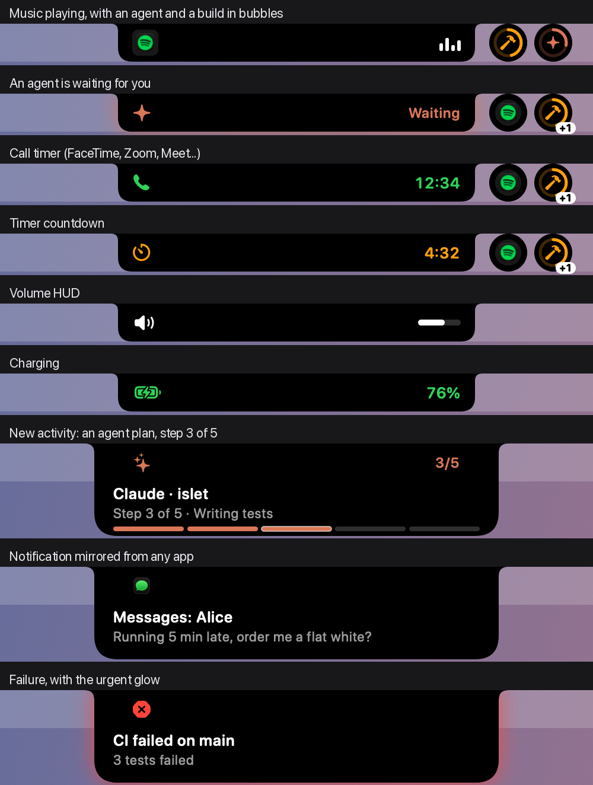
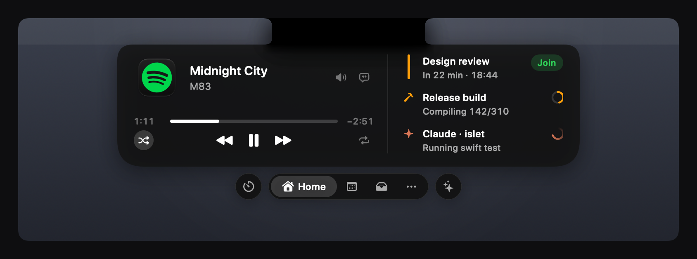

# Islet

**A free, open-source Dynamic Island for the Mac notch.** Music, calls, timers, your iPhone's Live Activities, coding agents and anything a script can send show up around the notch, and stay out of the way when nothing's happening.





## What it does

- **Your iPhone's Live Activities.** Rides, deliveries, scores and flights that macOS shows in the menu bar appear in the island with the app's icon and colour, including the ones the notch hides. 119 apps have their own look. See [Live Activities](docs/LIVE-ACTIVITIES.md).
- **Now Playing** from any app, browsers included, with a scrubber that seeks, ±15 s, shuffle and repeat, volume and an output picker. Each new song shows for a moment below the notch. Beside the notch, bars, a wave, a pulse, mirrored bars, artwork that turns like a record, or a little animated sticker (five of Islet's own, or a GIF of yours) show that it's playing. With a video in Chrome and a song in Spotify at once, small app icons beside the title switch between them, and the controls follow.
- **Coding agents.** See what Claude Code, Codex or Cursor is doing, answer their permission requests and questions from the notch, and watch your plan's usage limits. Agents can also drive the notch over MCP. See [Integrations](docs/INTEGRATIONS.md) and [MCP](docs/MCP.md).
- **Ask** Apple Intelligence, Claude, ChatGPT or your command-line agent a quick question. See [AI](docs/AI.md).
- **Timers and Pomodoro**, started from the island, a phrase like "tea 4m", Siri via Shortcuts ([recipes](docs/SHORTCUTS.md)) or a script.
- **Calendar and Reminders**: meeting reminders that count down beside the notch and stay until you join, a large Join button, the rest of today, and reminders you can tick off. When macOS hasn't allowed Islet to read your calendar, it says why and opens the right page of System Settings.
- **Calls, HUDs and system events**: call timers, volume and brightness, charging and battery, Focus, keep awake, a summary when you unlock.
- **A file shelf, clipboard history, download progress and script widgets** (xbar and SwiftBar plugins run unchanged).
- **Tools you turn on when you want them**: time-synced lyrics, your Shortcuts, the weather, a month calendar on Today, a stopwatch, Pomodoro lengths and focus sounds, a camera mirror and a teleprompter just under the camera, a stocks watchlist with sparklines, and today's sales from Stripe, Shopify, Lemon Squeezy, Gumroad, Dodo Payments, Polar and Paddle. Home can also show OpenRouter, Copilot and Ollama usage. Each starts off until you turn it on in Settings; the pages among them then appear under More. See [Tools](docs/TOOLS.md).
- **Your own activities** from the command line, a local HTTP API, the `islet://` URL scheme or iPhone Shortcuts. See the [API](docs/API.md).

## How it stays out of the way

- **It sits beside the notch, like the iPhone's.** It always stays in the menu bar row. With Accessibility it measures the menu bar and shrinks to the free space, down to just an icon each side, so it covers a menu bar icon only when the bar is packed right up to the notch.
- **It costs nothing when idle.** Everything is driven by events, looping animations run in Core Animation, and the pointer isn't watched until it reaches the notch. `make perf` checks each state against a CPU budget; the latest figures are in the [changelog](CHANGELOG.md).
- **It asks for nothing up front.** Each permission is requested when you turn on the feature that needs it.
- **It keeps things on your Mac.** No account, no telemetry, no licence server. Questions go to an AI provider only when you ask one, with your own key. Lyrics, the weather, sales, stocks and OpenRouter or Copilot usage reach the network only once you turn them on; lyrics and the weather send no more than the song or a rounded position, and Islet never reads another app's sign-in.
- **It's free and MIT-licensed**, written from scratch.

## Download

Islet is free and needs macOS 14 or later (Live Activity mirroring needs macOS 26, and is built for 27).

1. Download the zip from the [latest release](https://github.com/aviralgarg05/islet/releases/latest) and double-click it in Finder to unzip it.
2. Move `Islet.app` to Applications.
3. To use `isletctl` from Terminal, link it onto your `PATH`:

   ```bash
   ln -sf /Applications/Islet.app/Contents/MacOS/isletctl /opt/homebrew/bin/isletctl
   ```

The Releases page of this repository is the only official download. Each release is built from this repository's source at its tag. From 0.2.0 on, the release notes give the zip's SHA-256, which you can check with `shasum -a 256` on the downloaded file.

### Opening it the first time

Releases aren't notarised by Apple yet, so macOS blocks the first launch. To allow it:

1. Open Islet. macOS says it can't verify the app. Close the message, without choosing *Move to Trash*.
2. Open *System Settings → Privacy & Security* and scroll down to *Security*.
3. Next to the message that Islet was blocked, click **Open Anyway**.
4. Click **Open Anyway** again to confirm, and enter your password or use Touch ID.

You only need to do this once. On macOS 15 and later, Control-clicking the app and choosing *Open* no longer gets past this check, so use the steps above.

## Build from source

To build Islet yourself, you need the Xcode Command Line Tools or Xcode with the macOS 26 SDK or later (`xcrun --show-sdk-version` prints 26 or later); full Xcode isn't needed.

```bash
git clone https://github.com/aviralgarg05/islet.git islet && cd islet
make app          # builds build/Islet.app
make run          # builds and opens it
```

To keep it, copy it to Applications and put the command-line tool on your `PATH`:

```bash
make install
ln -sf /Applications/Islet.app/Contents/MacOS/isletctl /opt/homebrew/bin/isletctl
```

A build you make yourself opens without the steps above.

## Try it

Rest the pointer on the notch, or press **⌃⌥I**. **⌃⌥A** opens the Ask box.

```bash
isletctl notify "Hello from the notch" --icon sf:hand.wave.fill
isletctl timer "tea 4m"
isletctl run -- make release                   # shows while it runs, then done or failed
isletctl set deploy --title "Deploying" --progress 40
open "islet://timer?in=25m&title=Focus"
```

To connect a coding agent, press **Connect…** beside it in *Settings → Coding agents*, or copy [`integrations/claude-code/settings.json`](integrations/claude-code/settings.json), [`integrations/codex`](integrations/codex) or [`integrations/cursor`](integrations/cursor).

## Permissions (all optional)

| Feature | Permission |
|---|---|
| Fitting beside the notch, iPhone Live Activities, mirrored notifications, replacing the system HUD | Accessibility |
| Calendar events | Calendars |
| Reminders | Reminders |
| Download progress | Downloads folder |
| Weather where you are (a typed city needs nothing) | Location |
| Music and Spotify extras when the system bridge can't help | Automation |

Now Playing, volume, brightness, battery, calls, camera and microphone indicators, timers, the shelf, the Ask box and the API need no permission.

## Configure

Everything is in *Settings* (the capsule in the menu bar) and in `~/.config/islet/config.json`, which reloads when you edit it and can live in your dotfiles. The search field at the top of Settings finds any setting, and everything technical (the local API, the iPhone bridge, hook commands, script widgets) waits under *Advanced*.

## Develop

```bash
make test        # unit and system tests (swift-testing)
make e2e         # end-to-end checks against the real app, with its own config and port
make perf        # CPU for each island state against its budget
make snapshots   # renders every island state to build/snapshots/
make settings-snapshots  # renders every Settings page, light and dark
make demo        # runs with sample content
```

The code is split into `IsletCore` (pure, tested logic), `IsletSystem` (macOS adapters), `Islet` (the app) and `isletctl` (the CLI and MCP server). See [Architecture](docs/ARCHITECTURE.md) and [Research](docs/RESEARCH.md).

## Help and contributing

Questions go to [Discussions](https://github.com/aviralgarg05/islet/discussions), and bugs and ideas to [issues](https://github.com/aviralgarg05/islet/issues); [SUPPORT.md](SUPPORT.md) says what to include. Report security problems privately, as [SECURITY.md](SECURITY.md) describes. To send a change, read [CONTRIBUTING.md](CONTRIBUTING.md).

## Licence

MIT. See [LICENSE](LICENSE).
